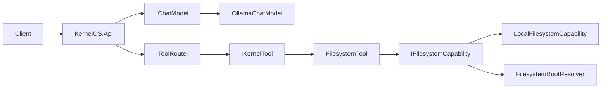

# Arquitectura de alto nivel

KernelOS es un monolito modular .NET 8. `KernelOS.Core` contiene contratos y modelos independientes; `KernelOS.Infrastructure` implementa Ollama, filesystem local y configuración; `KernelOS.Tools` contiene las herramientas; `KernelOS.Api` expone HTTP; `KernelOS.Tests` valida contratos y límites públicos.

La API no accede directamente al filesystem. `POST /filesystem/{operation}` delega siempre en `IToolRouter`; FilesystemTool es la única herramienta de filesystem y `LocalFilesystemCapability` es la implementación local actual. El resolver autoriza aliases y rutas absolutas frente a `AllowedRoots` antes de llamar a APIs de disco.

La implementación actual incluye chat local sin estado, Tool System, Planner determinista de una tarea explícita y Filesystem Read Only (`search`, `exists`, `metadata`, `resolve`, `list`). Memoria, MCP, tool calling del LLM, escritura y Watch de filesystem, proveedores remotos, voz y visión permanecen fuera de esta fase.
