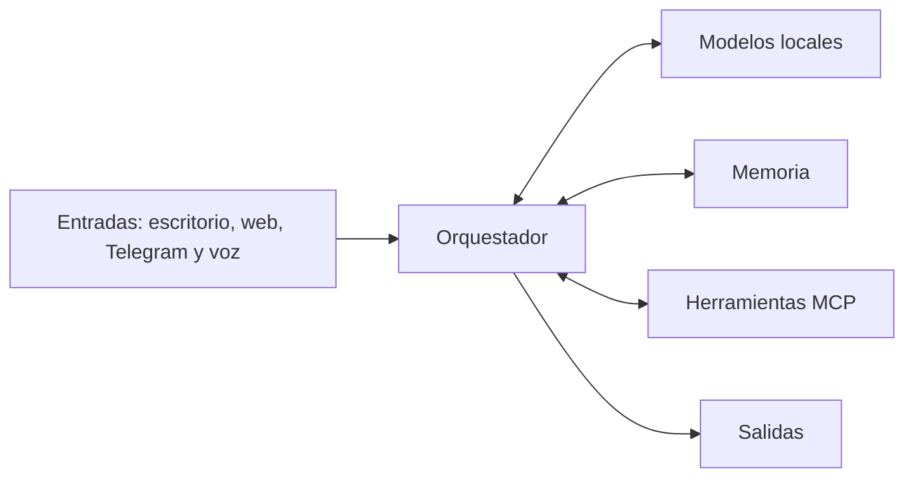

# Arquitectura de alto nivel

KernelOS organizará las entradas de escritorio, web, Telegram y voz mediante un orquestador central. El orquestador coordinará modelos locales, memoria y herramientas MCP, y devolverá resultados por las salidas adecuadas.

Esta representación es conceptual y no define aún componentes implementados.
