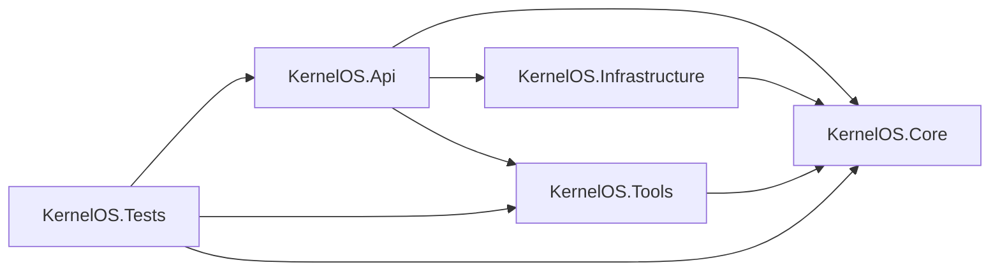

# Arquitectura de alto nivel

La primera versión ejecutable se organiza como un monolito modular dentro de una única solución .NET 8. `KernelOS.Api` contiene la API HTTP mínima y depende de los contratos de `KernelOS.Core`, la configuración de dependencias de `KernelOS.Infrastructure` y las abstracciones de `KernelOS.Tools`. `KernelOS.Tests` valida los endpoints y contratos básicos.

Actualmente, la API expone los endpoints de raíz y salud. No existen todavía integraciones de modelos, memoria, herramientas reales ni canales externos.

Las futuras entradas, modelos locales, memoria y herramientas controladas se incorporarán como módulos posteriores, conforme a la hoja de ruta.
