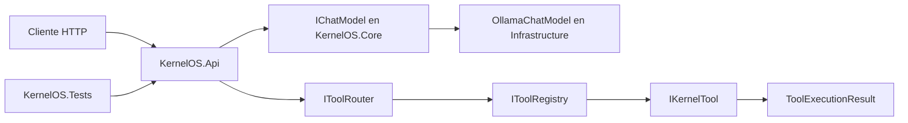

# Arquitectura de alto nivel

El núcleo inicial del Planner implementa `IPlanner` en Infrastructure y ejecuta una única Task explícita a través del Tool Router, sin depender de `IChatModel`.

KernelOS se mantiene como un monolito modular dentro de una única solución .NET 8. `KernelOS.Api` contiene los endpoints HTTP; `KernelOS.Core` declara contratos y modelos independientes; `KernelOS.Infrastructure` implementa el acceso a Ollama y su configuración; `KernelOS.Tools` implementa el sistema de herramientas. `KernelOS.Tests` valida los límites públicos y los contratos con dobles locales.

`IChatModel` desacopla KernelOS del proveedor de lenguaje. Kai es la identidad del asistente; Ollama es el proveedor local actual. El Tool System es una frontera independiente: Kai solicita una herramienta por contrato y el router la ejecuta sin elegirla ni acceder a recursos externos por su cuenta.

La implementación actual ofrece conversación sin estado y un Tool System base con EchoTool y TimeTool demostrativas. Memoria, tool calling del LLM, herramientas reales, canales externos, voz y visión permanecen fuera de esta fase.
