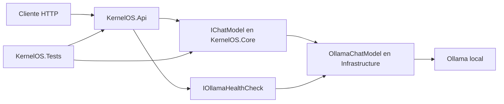

# Arquitectura de alto nivel

KernelOS se mantiene como un monolito modular dentro de una única solución .NET 8. `KernelOS.Api` contiene los endpoints HTTP; `KernelOS.Core` declara contratos y modelos sin depender de ningún proveedor; `KernelOS.Infrastructure` implementa el acceso a Ollama y su configuración; `KernelOS.Tools` reserva las abstracciones para herramientas futuras. `KernelOS.Tests` valida los endpoints y los contratos con dobles locales.

`IChatModel` desacopla KernelOS del proveedor de lenguaje. Kai es la identidad del asistente; Ollama es el proveedor local actual. En el futuro se podrán añadir otros proveedores de `IChatModel` sin cambiar Core ni el contrato público de conversación.

La implementación actual solo cubre conversación sin estado y una comprobación ligera de disponibilidad. Memoria, herramientas reales, canales externos y otras capacidades permanecen fuera de esta fase.
