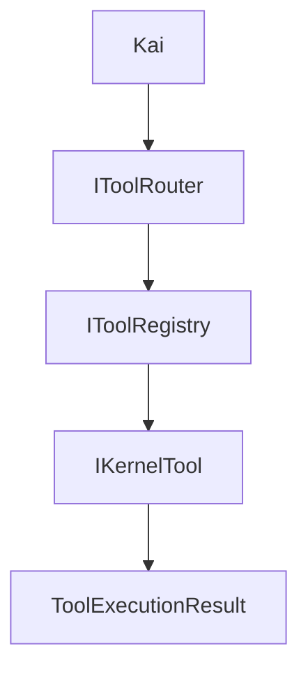

# Sistema de herramientas

## Propósito

Kai nunca ejecuta acciones directamente. Solicita una herramienta por medio de un contrato de Core y recibe un `ToolExecutionResult` seguro. Esto mantiene las acciones futuras bajo control, permite aplicar autorizaciones y evita que el modelo obtenga acceso implícito a recursos externos.

## Componentes

- `ToolExecutionRequest`, `ToolExecutionContext`, `ToolExecutionResult`, `ToolParameter` y `ToolCapability` viven en Core y no conocen infraestructura.
- `IKernelTool` describe por propiedades su nombre, categoría, capacidades, parámetros y operación de ejecución.
- `KernelToolRegistry` conserva las herramientas registradas por DI, detecta nombres duplicados y permite búsquedas. No examina ensamblados ni usa reflexión.
- `KernelToolRouter` busca por el nombre solicitado y ejecuta; no decide qué herramienta conviene usar, no contiene lógica específica y no accede directamente a recursos externos.

## Registro y ampliación

`AddKernelTools(IServiceCollection)` registra explícitamente las herramientas, el registro y el router. Para añadir una herramienta nueva se implementa `IKernelTool`, se describen sus contratos y se registra en esa extensión; después se añaden pruebas, documentación y, si la decisión afecta a la arquitectura, un ADR.

## Estado actual y límites

Solo existen `EchoTool`, que devuelve el texto recibido, y `TimeTool`, que lee la hora local. Son demostraciones para comprobar la arquitectura. No existe selección automática de herramientas ni tool calling del LLM, y no se implementan archivos, consola, Git, MCP, servicios externos ni control del sistema.
